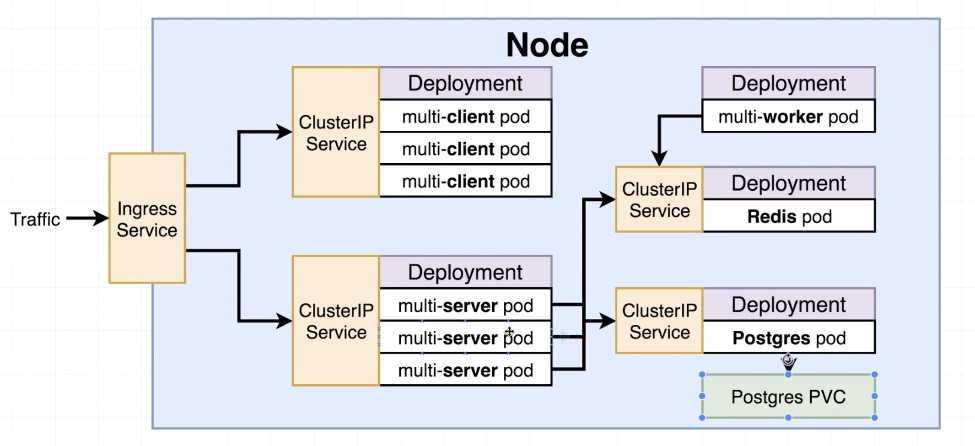

# k8s-production
Project to learn about running k8s in production

This is based on the Udemy Course: https://www.udemy.com/docker-and-kubernetes-the-complete-guide

Starting at Section 14 as this is when it starts to go from k8s in dev/test to k8s in production.

## Overview

## Things to try out/learn
* setup a clustered/HA Redis deployment